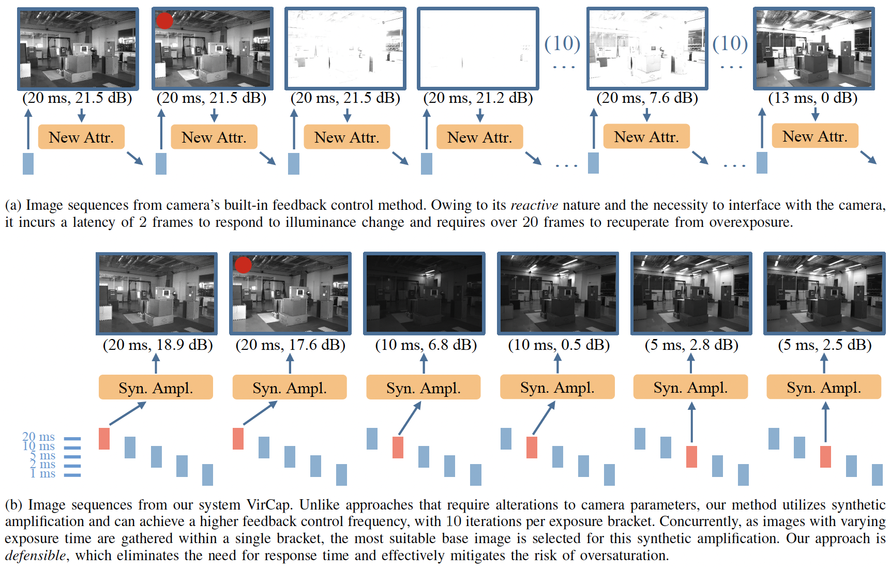
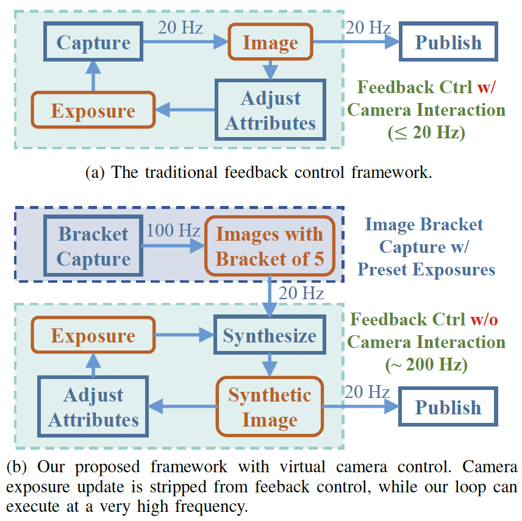

<!--
 * @Author: Shuyang Zhang
 * @Date: 2024-05-07 21:41:50
 * @LastEditors: ShuyangUni shuyang.zhang1995@gmail.com
 * @LastEditTime: 2024-05-07 21:47:52
 * @Description: 
 * 
 * Copyright (c) 2024 by Shuyang Zhang, All Rights Reserved. 
-->
# VirCap: Virtual Camera Exposure Control based on Image Photometric Synthesis for Visual SLAM Application

This is an official repository of

**VirCap: Virtual Camera Exposure Control based on Image Photometric Synthesis for Visual SLAM Application**, Shuyang Zhang, Jinhao He, Bowen Yang, Yilong Zhu, Jin Wu, Jianhao Jiao, Jie Yuan

This paper is still under review. The full paper and codes will be released when the review process is finished.

## Highlights
* A camera exposure control framework that employs photometric image synthesis techniques to attain update and control frequencies surpassing those of the camera’s hardware limitations.
* An exposure allocation method that balances image background noise and motion blur, using an intrinsic metric from a single image instead of interframe information.
* Sufficient experiments that shows the performance improvement in drastic illuminance change and motion blur case, on the backend application of visual SLAM.

## Main Ideas
### Virtual Capture
* Our VirCap does not need to interact with the camera's hardware interfaces to update the exposure parameters (exposure time and analogy gain) online; Thus, the camera's parameters can be updated at a very high frequency (~200 Hz).
* We use **exposure bracketing technique** to capture a group of images with different exposures to backup information over a high dynamic range.
* We implicitly maintain and update a target exposure, and the output images are generated by
    1. Selecting an appropriate base image from the bracket;
    2. Synthesizing a virtual image with the target exposure to output.
* An Explaination from the imaging principle
  * All the images in the bracket do not introduce the analogy gain (set to 0 dB)
  * **Our VirCap introduces image gain into the image after imaging;** thus the gain process is peeled off from camera's hardware interaction.

### Exposure Allocation method
* Purpose
  * To divide the target exposure value to the **exposure time** and **analogy gain**
  * To balance both image **background noise** and **motion blur**
* Since our bracketing capture mode, the exposure allocation task turns to firstly select a basic image (choose the exposure time) and then calculate the synthesis amplification (choose the gain).
* It should be noted that for the same target exposure, there can be different combinations of exposure time and gain.
  * Suppose a target exposure of 20 ms, we can
    1. use base image of 1 ms and amplify 20 times;
    2. use base image of 5 ms and amplify 4 times;
    3. use base image of 20 ms and do not amplify;
    4. ...
  * All the combinations are reasonable，the difference is that **when the exposure time is larger, the potential motion blur will be worse, but noise will be lower; vice versa**.
* We design an image metric balancing both image motion blur and background noise, to select the base image from the bracket.

  

  <strong> Image sequences in a drastic illuminance change scenario. Images with red circle indicate the first frame of illuminance change. </strong>

  

  <strong> The comparison between traditional camera control framework and our VirCap </strong>

